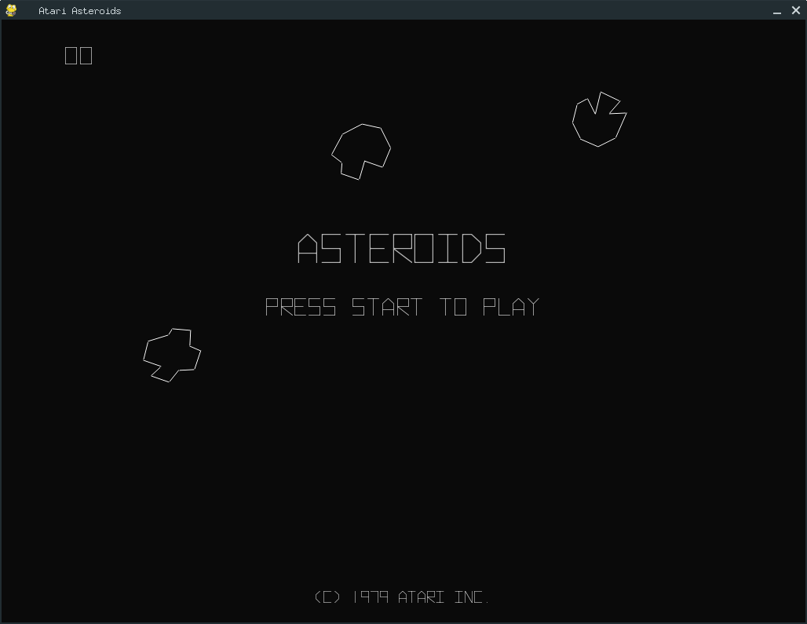

[[🇧🇷] Leia em Português](./README.pt.md)

# Asteroids

A modern recreation of the classic **Atari Asteroids (1979)** built with **Python** and **Pygame**.

Pilot your spaceship through an endless asteroid field, destroy enemy saucers, earn points, and survive as long as possible. This project reproduces the core arcade experience while using a clean, modular architecture that separates game entities, collision handling, audio, scoring, and user interface components.

## Preview

*Classic vector-style gameplay inspired by the original arcade release.*



## Features

### Gameplay

* Classic Asteroids-inspired mechanics
* Infinite asteroid waves
* Large, medium, and small asteroids
* Asteroid fragmentation system
* Screen wrap-around movement
* Player lives system
* Extra life awarded every **10,000 points**
* Enemy flying saucers
* Saucer projectile attacks
* Game Over and restart system
* Pause system

### Visuals

* Retro vector-style graphics
* Procedurally generated asteroid shapes
* Explosion particle effects
* Arcade-inspired HUD
* Authentic Hyperspace font

### Audio

* Shooting sound effects
* Engine thrust sounds
* Asteroid explosion sounds
* Flying saucer sounds
* Extra-life notification sounds

### Architecture

* Modular and object-oriented design
* Dedicated collision manager
* Dedicated game state manager
* Centralized audio management
* Separate UI and score systems

## Controls

| Key               | Action         |
| ----------------- | -------------- |
| ← / →             | Rotate ship    |
| ↑                 | Thrust         |
| Space             | Shoot          |
| Enter             | Start game     |
| P                 | Pause / Resume |
| Space (Game Over) | Restart        |

## Project Structure

```text
asteroids/
├── run_game.py
├── res/
│   ├── FIRE.WAV
│   ├── LIFE.WAV
│   ├── THRUST.WAV
│   ├── EXPLODE1.WAV
│   ├── EXPLODE2.WAV
│   ├── EXPLODE3.WAV
│   ├── SSAUCER.WAV
│   ├── LSAUCER.WAV
│   └── Hyperspace.otf
│
└── src/
    ├── audio/
    ├── core/
    ├── entities/
    ├── ui/
    └── constants.py
```

## Installation

### Requirements

* Python 3.10+
* Pygame

### Clone the repository

```bash
git clone https://github.com/your-username/asteroids.git
cd asteroids
```

### Install dependencies

```bash
pip install pygame
```

## Running the Game

```bash
python run_game.py
```

## Game Mechanics

### Scoring

| Target          | Points |
| --------------- | ------ |
| Large Asteroid  | 20     |
| Medium Asteroid | 50     |
| Small Asteroid  | 100    |
| Large Saucer    | 200    |
| Small Saucer    | 1000   |

### Extra Lives

An extra life is awarded every:

```text
10,000 points
```

## Technical Highlights

### Collision System

The game uses a centralized collision manager responsible for:

* Player ↔ Asteroid collisions
* Bullet ↔ Asteroid collisions
* Bullet ↔ Saucer collisions
* Saucer Bullet ↔ Player collisions

### Asteroid Splitting

Destroyed asteroids split according to their size:

```text
Large → 3 Medium
Medium → 2 Small
Small → Destroyed
```

### State Management

The game operates using four states:

```text
START
PLAYING
PAUSE
GAME_OVER
```

## Educational Purpose

This project was developed as a study of:

* Object-Oriented Programming (OOP)
* Game development with Pygame
* Event-driven programming
* Collision detection
* State management
* Modular software architecture

## Assets

This project includes:

* Retro arcade sound effects
* Hyperspace font
* Custom vector-style rendering

All assets remain the property of their respective owners.

## License

This project is licensed under the MIT License.

See the [LICENSE](LICENSE) file for more information.